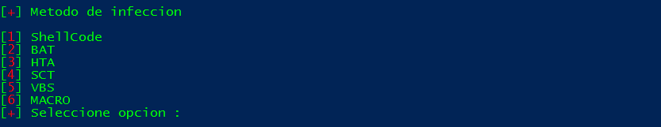

# PsBoTelegram
Backdoor using Telegram and Powershell. Por favor, usad sólo vuestros equipos para las pruebas.  
No me hago responsable de un mal uso del software. Rercordad que esto sólo es una prueba de concepto.  

Podeis probar el script abriendo una consola de powershell y ejecutando este comando:

**IEX (curl "https://raw.githubusercontent.com/Hackplayers/PSBoTelegram/master/PSBoTelegram.ps1" ).content**&nbsp;&nbsp;

        ____  _____ ____      ______     __
       / __ \/ ___// __ )____/_  __/__  / /__   ____ __________ _____ __
      / /_/ /\__ \/ __  / __ \/ / / _ \/ / _ \/ __  / ___/ __  / __  __ \
     / ____/___/ / /_/ / /_/ / / /  __/ /  __/ /_/ / /  / /_/ / / / / / /
    /_/    /____/_____/\____/_/  \___/_/\___/\__, /_/   \__,_/_/ /_/ /_/
                                            /____/

                                                     v0.8 by CyberVaca @ HackPlayers

PSBotTelegram es un script escrito en Powershell, que nos crea una backdoor que se conecta a un BOT de Telegram. El BOT se controlará por mensajes de Telegram. Al ejecutar el script nos va a pedir tres datos necesarios para crear el shellcode. 

# Instalación en Linux

    git clone https://github.com/hackplayers/psbotelegram.git
    cd psbotelegram
    sudo apt-get update > /dev/null
    sudo apt-get install libunwind8 libicu55 
    wget https://github.com/PowerShell/PowerShell/releases/download/v6.0.0-alpha.13/powershell_6.0.0-alpha.13-1ubuntu1.16.04.1_amd64.deb
    sudo dpkg -i powershell_6.0.0-alpha.13-1ubuntu1.16.04.1_amd64.deb
    powershell ./PSBoTelegram.ps1

# Instalación en Windows

    Powershell.exe ./PSBotelegram.ps1
    
Los datos que nos pide son los siguientes:  

# Parametros
  
 
**[+] Introduzca el Token del Bot de Telegram:** "Aquí deberemos poner el Token del bot que hayamos creado."  
**[+] Introduzca su Chat ID:** "Aquí deberemos poner nuestro ID de Telegram."  
**[+] Introduzca el delay para la conexión:** "En este campo seteamos el delay(retardo) entre en pc con el backdoor y nuestro chat de telegram"   

# Salidas de archivo:
  

Una vez introducido estos datos, nos creará un shellcode en BASE64 en un tipo de archivo seleccionado para ejecutarlo en el equipo a auditar.  

# Funciones del backdoor.

[1]&nbsp;&nbsp;&nbsp;**/Help**&nbsp;&nbsp; (Nos muestra la ayuda)  
[2]&nbsp;&nbsp;&nbsp;**/Info**&nbsp;&nbsp; (Devuelve información sobre el equipo)   
[3]&nbsp;&nbsp;&nbsp;**/Shell**&nbsp;&nbsp; (/Shell + CmdLet a ejecutar )  
[4]&nbsp;&nbsp;&nbsp;**/Whoami**&nbsp;&nbsp; (Devuelve el usuario que ejecutó el codigo)  
[5]&nbsp;&nbsp;&nbsp;**/Ippublic**&nbsp;&nbsp; (Nos da IP publica, Pais y Ciudad del Target)  
[6]&nbsp;&nbsp;&nbsp;**/Kill**&nbsp;&nbsp; (Mata el backdoor)  
[7]&nbsp;&nbsp;&nbsp;**/Scriptimport**&nbsp;&nbsp; (Importa el script de powershell pasandole una url)  
[8]&nbsp;&nbsp;&nbsp;**/Shell nc (netcat)**&nbsp;&nbsp; (Función de powercat https://github.com/besimorhino/powercat
)  
[9]&nbsp;&nbsp;&nbsp;**/Download**&nbsp;&nbsp; (Download mas ruta nos descarga el archivo)  
[10]&nbsp;&nbsp;**/Screenshot**&nbsp;&nbsp; (Realiza screenshot y nos lo envia)  
[11]&nbsp;&nbsp;**/Audio**&nbsp;&nbsp; (/Audio X, Grabaría X segundos de audio y nos lo envia)  
[12]&nbsp;&nbsp;**/BypassUAC**&nbsp;&nbsp; (Ejecuta el Bot con privilegios administrativos)  
[13]&nbsp;&nbsp;**/Persistence**&nbsp;&nbsp; (/Persistence ON/OFF)  
[14]&nbsp;&nbsp;**/MimiGatoz**&nbsp;&nbsp; (Ejecuta Mimikatz modificado para el bypass AV y nos envia los datos)  
[15]&nbsp;&nbsp;**/Keylogger-Selective**&nbsp;&nbsp; (Ejecuta un Keylogger selectivo, ejemplo /keylogger-Selective Facebook)  
[16]&nbsp;&nbsp;**/Mimikittenz**&nbsp;&nbsp; (Ejecuta Mimikittenz, comprobando si el equipo es vulnerable y si no lo es, lo hace vulnerable... )  

# PsBoTelegram English 
Backdoor using Telegram and Powershell. Please use only your test equipment.
I am not responsible for any misuse of the software. Make sure this is only a proof of concept. 

You can test the script by opening a powershell console and running this command:

**IEX (curl "https://raw.githubusercontent.com/Hackplayers/PSBoTelegram/master/PSBoTelegram.ps1" ).content**&nbsp;&nbsp;

        ____  _____ ____      ______     __
       / __ \/ ___// __ )____/_  __/__  / /__   ____ __________ _____ __
      / /_/ /\__ \/ __  / __ \/ / / _ \/ / _ \/ __  / ___/ __  / __  __ \
     / ____/___/ / /_/ / /_/ / / /  __/ /  __/ /_/ / /  / /_/ / / / / / /
    /_/    /____/_____/\____/_/  \___/_/\___/\__, /_/   \__,_/_/ /_/ /_/
                                            /____/

                                                     v0.8 by CyberVaca @ HackPlayers

PSBotTelegram is a script written in Powershell, which creates a backdoor that connects to a Telegram BOT. The BOT will be controlled by Telegram messages. When executing the script we will ask for three data needed to create the shellcode.

