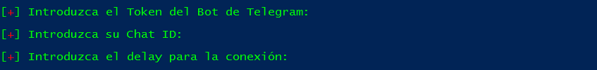

# PsBoTelegram
Backdoor using Telegram and Powershell  

        ____  _____ ____      ______     __
       / __ \/ ___// __ )____/_  __/__  / /__   ____ __________ _____ __
      / /_/ /\__ \/ __  / __ \/ / / _ \/ / _ \/ __  / ___/ __  / __  __ \
     / ____/___/ / /_/ / /_/ / / /  __/ /  __/ /_/ / /  / /_/ / / / / / /
    /_/    /____/_____/\____/_/  \___/_/\___/\__, /_/   \__,_/_/ /_/ /_/
                                        /____/

                                                     v0.3 by CyberVaca @ Luis Vacas

PSBotTelegram es un script escrito en Powershell que nos crea una backdoor que se conecta a Telegram y se gestiona desde Telegram. Al ejecutar el script nos va a pedir tres datos necesarios para crear el shellcode.  

Los datos que nos pide son los siguientes:  

# Parametros
  
 
**[+] Introduzca el Token del Bot de Telegram:** "Aquí deberemos poner el Token del bot que hayamos creado."  
**[+] Introduzca su Chat ID:** "Aquí deberemos poner nuestro ID de Telegram."  
**[+] Introduzca el delay para la conexión:** "En este campo seteamos el delay(retardo) entre en pc con el backdoor y nuestro chat de telegram"   

Una vez introducido estos datos, nos creará un shellcode en BASE64 para ejecutarlo en el equipo objetivo.  

# Funciones del backdoor.

[1]&nbsp;&nbsp;&nbsp;**/Help**&nbsp;&nbsp; (Nos muestra la ayuda)  
[2]&nbsp;&nbsp;&nbsp;**/Info**&nbsp;&nbsp; (Devuelve información sobre el equipo)   
[3]&nbsp;&nbsp;&nbsp;**/Shell**&nbsp;&nbsp; (/Shell + CmdLet a ejecutar )  
[4]&nbsp;&nbsp;&nbsp;**/Whoami**&nbsp;&nbsp; (Devuelve el usuario que ejecutó el codigo)  
[5]&nbsp;&nbsp;&nbsp;**/Ippublic**&nbsp;&nbsp; (Nos da IP publica, Pais y Ciudad del Target)  
[6]&nbsp;&nbsp;&nbsp;**/Kill**&nbsp;&nbsp; (Mata el backdoor)  
[7]&nbsp;&nbsp;&nbsp;**/Scriptimport**&nbsp;&nbsp; (Importa el script de powershell pasandole una url)  
[8]&nbsp;&nbsp;&nbsp;**/Shell nc (netcat)**&nbsp;&nbsp; (Función de powercat https://github.com/besimorhino/powercat
)  
[9]&nbsp;&nbsp;&nbsp;**/Download**&nbsp;&nbsp; (Download mas ruta nos descarga el archivo)  
[10]&nbsp;&nbsp;**/Screenshot**&nbsp;&nbsp; (Realiza screenshot y nos lo envia)  
[11]&nbsp;&nbsp;**/Audio**&nbsp;&nbsp; (Audio 5, Grabaria 5 segundos de audio y nos lo envia)  
